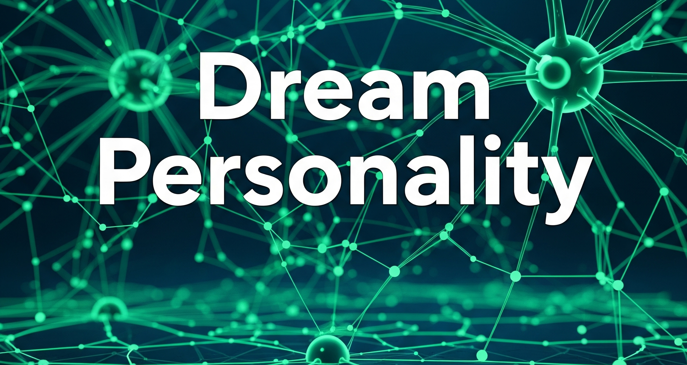

# Dreampersonality

This is a fun project using the Stable Diffusion pipeline and IP-Adapter model to create your dream personality. It demonstrates how to generate face embeddings from an image and use these embeddings to guide the synthesis of new images using Stable Diffusion. The process leverages multiple tools and libraries, including `diffusers`, `ip_adapter`, `insightface`, and `onnxruntime`.
# Demo(Click to View!)
[](https://drive.google.com/file/d/1icdel9Mgh6jZhZ8pYfcOt1DXgPzzIOgf/view)

# Example


## Installation

To get started, install the necessary dependencies:

```bash
pip install diffusers
pip install ip_adapter
pip install insightface
pip install onnxruntime
pip install einops

````
Usage
Step 1: Import Libraries
First, import the required libraries:
````

python
Copy code
import torch
from diffusers import StableDiffusionPipeline, StableDiffusionImg2ImgPipeline, StableDiffusionInpaintPipelineLegacy, DDIMScheduler, AutoencoderKL
from PIL import Image
from insightface.app import FaceAnalysis
from ip_adapter import IPAdapterPlus
import cv2


````
Step 2: Generate Face Embeddings
Use insightface to generate face embeddings from an input image:
````
python
Copy code
# Initialize FaceAnalysis app
app = FaceAnalysis(name="buffalo_l", providers=['CUDAExecutionProvider', 'CPUExecutionProvider'])
app.prepare(ctx_id=0, det_size=(640, 640))

# Read the input image
image = cv2.imread("person.jpg")
faces = app.get(image)

# Extract face embeddings
faceid_embeds = torch.from_numpy(faces[0].normed_embedding).unsqueeze(0)
faceid_embeds

````
Step 3: Download Models
Download the necessary models from Hugging Face:
````
python
Copy code
from huggingface_hub import hf_hub_download

base_model_path = "SG161222/Realistic_Vision_V4.0_noVAE"
vae_model_path = "stabilityai/sd-vae-ft-mse"
image_encoder_path = "laion/CLIP-ViT-H-14-laion2B-s32B-b79K"
ip_ckpt = hf_hub_download(repo_id="h94/IP-Adapter-FaceID", filename="ip-adapter-faceid_sd15.bin", repo_type="model")
device = "cuda"
````
Step 4: Define Helper Functions
Define helper functions such as image_grid for displaying images in a grid format:
````
python
Copy code
def image_grid(imgs, rows, cols):
    assert len(imgs) == rows * cols

    w, h = imgs[0].size
    grid = Image.new('RGB', size=(cols * w, rows * h))
    grid_w, grid_h = grid.size

    for i, img in enumerate(imgs):
        grid.paste(img, box=(i % cols * w, i // cols * h))
    return grid

````
Step 5: Initialize Models
Initialize the Stable Diffusion pipeline and IP-Adapter:
````
python
Copy code
# Initialize DDIM Scheduler
noise_scheduler = DDIMScheduler(
    num_train_timesteps=1000,
    beta_start=0.00085,
    beta_end=0.012,
    beta_schedule="scaled_linear",
    clip_sample=False,
    set_alpha_to_one=False,
    steps_offset=1,
)

# Load VAE model
vae = AutoencoderKL.from_pretrained(vae_model_path).to(dtype=torch.float16)

# Load Stable Diffusion pipeline
pipe = StableDiffusionPipeline.from_pretrained(
    base_model_path,
    torch_dtype=torch.float16,
    scheduler=noise_scheduler,
    vae=vae,
    feature_extractor=None,
    safety_checker=None
)

# Load IP-Adapter
from ip_adapter.ip_adapter_faceid import IPAdapterFaceID
ip_model = IPAdapterFaceID(pipe, ip_ckpt, device)
````
Step 6: Generate Images
Generate new images guided by the face embeddings:
````
python
Copy code
prompt = "photo of a man in India drinking tea at a tea stall, realistic, clear face"
negative_prompt = "low quality, blur image"

images = ip_model.generate(
    faceid_embeds,
    prompt=prompt,
    negative_prompt=negative_prompt,
    num_samples=4,
    seed=480,
    num_inference_steps=100
)

# Display generated images in a grid
grid = image_grid(images, 1, 4)
grid.show()
````
Conclusion
This project showcases how to combine multiple state-of-the-art tools for face embedding generation and image synthesis. By following the steps outlined above, you can generate realistic images guided by specific facial features extracted from input images.

License
This project is licensed under the MIT License - see the LICENSE file for details.
````
